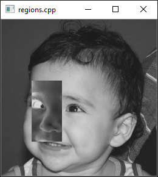
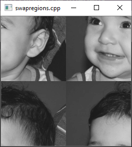
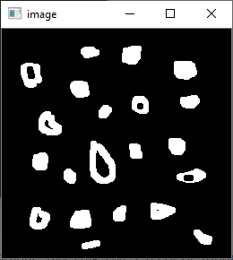
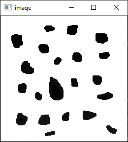
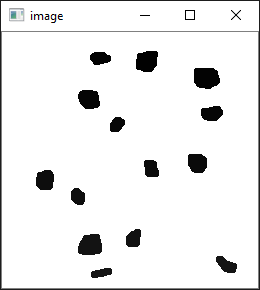
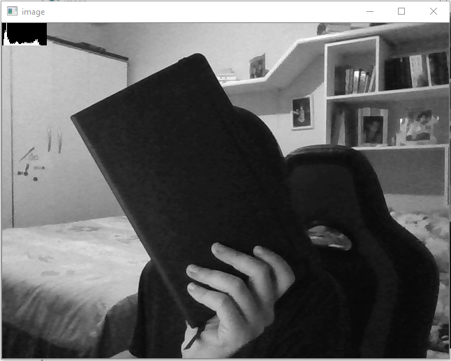
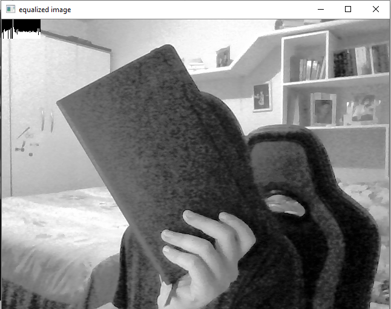
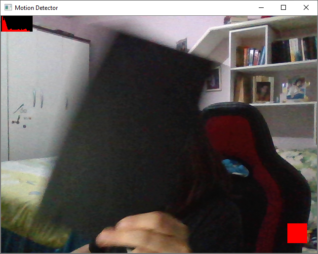

Relatório referente aos exercícios 2 - 6.

## Manipulando pixels em uma imagem

### Região negativa

O primeiro exercício da seção consiste em implementar um programa `regions.cpp`, que solicita ao usuário as coordenadas de dois pontos e exibe o negativo da região definida por eles.

Após a leitura da imagem e a solicitação das coordenadas de cada ponto, é necessário verificar se eles estão localizados dentro dos limites do tamanho da imagem e se P2 > P1. Essa verificação é feita nas funções `isvalid()` e `isgreater()`. 

``` cpp
bool isvalid(int x, int y, int w, int h) {
    if (x < 0 || x > w) 
    {
        return false;
    }

    if (y < 0 || y > h)
    {
        return false;
    }

    return true;
}

bool isgreater(int x1, int x2, int y1, int y2) {
    if (x1 > x2 || y1 > y2)
    {
        return false;
    }

    return true;
}
```

Para calcular o negativo, subtraímos o valor de cada pixel da imagem de 255.

```cpp
for (int i = x1; i < x2; i++) {
    for (int j = y1; j < y2; j++) {
        image.at<uchar>(i, j) = 255 - image.at<uchar>(i, j);
    }
}
```

A saída do programa é mostrada na imagem abaixo.



### Trocando regiões

O segundo exercício pede a implementação de um programa `swapregions.cpp`, que deve receber uma imagem e trocar os seus quadrantes. Para fazer essa troca, 4 novas regiões são criadas a partir da imagem de entrada usando a classe `Mat`, cada uma dessas regiões recebeu um quadrante da imagem.

```cpp
cv::Mat one(image, Rect(0, 0, (width / 2), (height / 2)));
cv::Mat two(image, Rect((width / 2), 0, (width / 2), (height / 2)));
cv::Mat three(image, Rect(0, (height / 2), (width / 2), (height / 2)));
cv::Mat four(image, Rect((width / 2), (height / 2), (width / 2), (height/2)));
```

Os quadrantes são então concatenados para formar a imagem de saída.

```cpp
cv::Mat first, second;
    
cv::vconcat(four, two, first);
cv::vconcat(three, one, second);

cv::hconcat(first, second, image);
```

A saída do programa é mostrada a seguir.



## Preenchendo regiões

Esse exercício pede para que o algoritmo de contagem seja aprimorado, fazendo com que seja possível identificar bolhas com ou sem buracos internos, excluindo as bolhas que tocam as bordas da imagem.


Para retirar as bolhas das bordas, percorre-se as primeiras e últimas linhas e colunas da imagem em busca de elementos com tom de cinza igual a 255. Quando encontrado, a função `floodfill` é chamada utilizando o pixel encontrado como semente, rotulando a região com tom de cinza 0.

```cpp
for (int i = 0; i < height; i++)
{
    for (int j = 0; j < width; j++)
    {
        if (i == 0 || i == height - 1 || j == 0 || j == width - 1)
        {
            if (image.at<uchar>(i, j) == 255)
            {
                p.x = j;
                p.y = i;
                floodFill(image, p, 0);
            }
        }
    }
}
```



A imagem é entao rotulada usando o algoritmo de contagem apresentado no código original `labeling.cpp` e a cor de fundo é trocada para o tom de cinza 255.

```cpp
nobjects = 0;
for (int i = 0; i < height; i++) {
    for (int j = 0; j < width; j++) {
        if (image.at<uchar>(i, j) == 255)
        {
            nobjects++;
            p.x = j;
            p.y = i;
            
            cv::floodFill(image, p, nobjects);
        }
    }
}

p.x = 0;
p.y = 0;

cv:floodFill(image, p, 255);
```



Inicia-se então um contador `holes` para armazenar a quantidade de bolhas com buracos. Para encontrar essas bolhas, percorre-se as linhas e colunas da matriz em busca de elementos com tom de cinza igual a 0. Uma vez que um elemento é encontrado, o contador é incrementado e o algoritmo `floodfill` é executado duas vezes, uma usando o pixel encontrado (`p.x = j` e `p.y = i`) como semente e outra usando o pixel à sua esquerda (`p.x = j-1` e `p.y = i`), rotulando a região com tom de cinza 255.

```cpp
holes = 0;
for (int i = 1; i < height; i++) 
{
    for (int j = 1; j < width; j++) 
    {
        if (image.at<uchar>(i, j) == 0) 
        {
            holes++;
            p.x = j;
            p.y = i;
            floodFill(image, p, 255);
            p.x = j - 1;
            floodFill(image, p, 255);
        }
    }
}

std::cout << "a figura tem " << nobjects << " bolhas\n";
std::cout << holes << " bolhas com buracos e " << (nobjects - holes) << " bolhas sem buracos\n";
```

A saída do programa é apresentado a seguir.



```c
A figura tem 21 bolhas.
7 bolhas com buracos e 14 bolhas sem buracos.
```

## Manipulação de histogramas

### Equalização de histograma

No exercício de equalização, pede-se que, para cada imagem capturada, seja realizada uma equalização do seu histograma antes de exibi-la. A captura de vídeo é feita através da classe `VideoCapture` do OpenCV.

A equalização é feita através da função `equalizeHist()`  dentro do loop de captura das imagens. Os histogramas da imagem original e da imagem equalizada são calculados e mostrados na tela junto com as imagens capturadas.

```cpp
while (1) {
    cap >> image;
    cvtColor(image, image, cv::COLOR_BGR2GRAY);
    equalizeHist(image, eq_image);

    cv::calcHist(&image, 1, 0, cv::Mat(), hist, 1, &nbins, &histrange, uniform, accumulate);
    cv::calcHist(&eq_image, 1, 0, cv::Mat(), histEq, 1, &nbins, &histrange, uniform, accumulate);

    cv::normalize(hist, hist, 0, histImg.rows, cv::NORM_MINMAX, -1, cv::Mat());
    cv::normalize(histEq, histEq, 0, histImgEq.rows, cv::NORM_MINMAX, -1, cv::Mat());

    histImg.setTo(cv::Scalar(0));
    histImgEq.setTo(cv::Scalar(0));

    for (int i = 0; i < nbins; i++) {
        cv::line(histImg,
            cv::Point(i, histh),
            cv::Point(i, histh - cvRound(hist.at<float>(i))),
            cv::Scalar(255), 1, 8, 0);
    }

    histImg.copyTo(image(cv::Rect(0, 0, nbins, histh)));

    for (int i = 0; i < nbins; i++) {
        cv::line(histImgEq,
            cv::Point(i, histh),
            cv::Point(i, histh - cvRound(histEq.at<float>(i))),
            cv::Scalar(255), 1, 8, 0);
    }

    histImgEq.copyTo(eq_image(cv::Rect(0, 0, nbins, histh)));

    cv::imshow("image", image);
    cv::imshow("equalized image", eq_image);

    key = cv::waitKey(30);  
    if (key == 27) break;
}
```




### Detector de movimentos

No segundo exercício da seção 4, pede-se para implementar um programa `motiondetector.cpp`, que calcula o histograma da imagem de forma contínua e o compara com o último histograma calculado, ativando um alarme quando um limiar pré-estabelecido for ultrapassado. Para este exercício, apenas o histograma da componente de cor vermelha foi considerado.

Após o cálculo do histograma de dois frames, a função `compareHist()` é executada utilizando o método da distância de Bhattacharyya para calcular a diferença. Calculada a diferença entre os histogramas, o valor resultante é comparado com o limiar escolhido (7). Se a diferença for maior, um quadrado vermelho é exibido na imagem e a frase `Movimento detectado!` é exibida no terminal.

```cpp
cap >> frame1;
cv::split(frame1, planes);
cv::calcHist(&planes[0], 1, 0, cv::Mat(), histR1, 1, &nbins, &histrange, uniform, acummulate);

cv::normalize(histR1, histR1, 0, histImgR.rows, cv::NORM_MINMAX, -1, cv::Mat());

histImgR.setTo(cv::Scalar(0));

cap >> frame2;
cv::split(frame2, planes);
cv::calcHist(&planes[0], 1, 0, cv::Mat(), histR2, 1, &nbins, &histrange, uniform, acummulate);

cv::normalize(histR2, histR2, 0, histImgR.rows, cv::NORM_MINMAX, -1, cv::Mat());

comp = compareHist(histR1, histR2, 4);

val[0] = 0;   //B
val[1] = 0;   //G
val[2] = 255; //R

if (comp > 7) {
    std::cout << "Movimento detectado!" << std::endl;

    for (int i = 420; i < 460; i++) {
        for (int j = 580; j < 620; j++) {
            frame1.at<Vec3b>(i, j) = val;
        }
    }
}
```



## Filtragem no domínio espacial

### Filtro laplaciano do gaussiano

